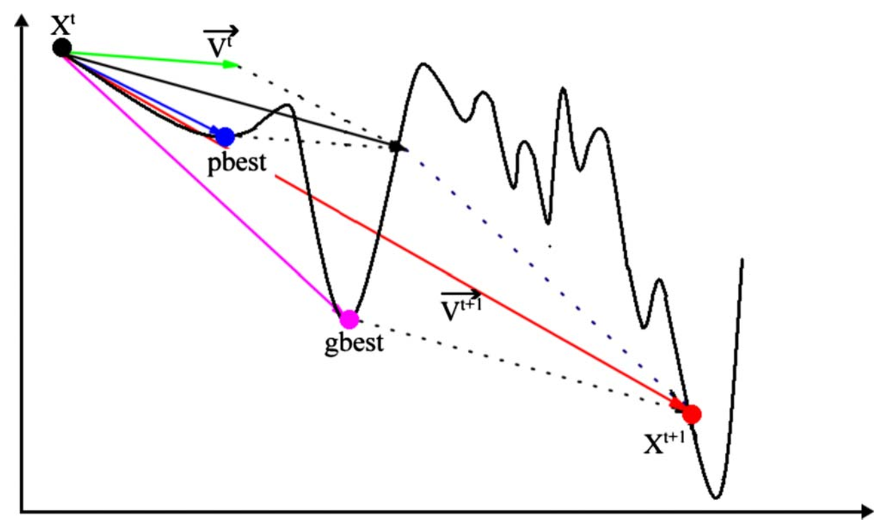

<!-- _class: lead -->

# Bibliographic project
## Generation of optimized structures through Particle Swarn Optimization
**Antoine GISSLER** - Sorbonne Université
January 2023

Repository: <a href="https://github.com/antoinegslr/ParticleSwarnOptimization">https://github.com/antoinegslr/ParticleSwarnOptimization</a>

---

# Introduction

   

## Novel phases in ammonia-water mixtures under pressure
<h3 style="color:gray;">Victor Naden Robinson, Miriam Marqués, Yanchao Wang, Yanming Ma, Andreas Hermann</h3>
 
<h6 style="color:black;">Crystal structure prediction in Saturn and Uranus' mantles</h6>

---
# Introduction

  

Crystal structure prediction requires **sampling** of multiple structures 
**Some existing methods:**
* Monte Carlo
* Simulated annealing
* Minima/basin hopping
* Metadynamics
* Genetic algorithm

**Figure 1:** Eggholder function
(Nathan Rooy on [GitHub](https://github.com/nathanrooy/landscapes))

---
# Introduction

 

**Crystals in Saturn and Uranus:**
* Presence of water ices and ammonia in similar quantities
* High pressures and temperatures

**Problems using previous methods:**
* High computational cost
* High energetic barriers to cross
* Has everything been sampled?
* Everything is unknown

**Figure 2:** Saturn by Hubble telescope
([Nasa](https://solarsystem.nasa.gov/resources/2490/saturns-rings-shine-in-hubble-portrait/?category=planets_saturn), September 2019)

---
# Particle Swarn Optimization (PSO)
 

> Population-based optimization algorithm based on behaviors of birds in a flock

**Figure 3:** Bird flock, by ...

**Figure 4:** PSO principle, by ...

$$v_{i,j}^{t+1}=\omega v_{i,j}^t+c_1r_1(\verb+pbest+_{i,j}^t-x_{i,j}^t)+c_2r_2(\verb+gbest+_{i,j}^t-x_{i,j}^t)$$
---
# How does it work?
- Generation of one random structure per symmetry
- Local optimization of every structure
- Exclusion of similar structures *(through bond characterization matrix)*
- Generation of new structures by PSO, using personal and flock's hystories (global best minimum $\verb+gbest+$ and personnal best minimum $\verb+pbest+$)
- Repetition of the three last steps until convergence (difference between two consecutive minimal values less than a defined epsilon)
> The program then returns the configuration associated to the lowest energy

---
# PSO for crystal structure prediction

## Results from previous studies
Bref voilà dire que y'avait des trucs, avec trois phases et tout

---
# PSO for crystal structure prediction

Et là paf dire ô combien cette méthode est magique pour les trois phases : découverte de nouvelles phases avec peu d'itérations

---
# PSO for crystal structure prediction
Là on peut dire que y'a même une nouvelle phase qui a été découverte !

---

# Slide 1: Introduction

Definition: Particle Swarm Optimization (PSO) is a population-based optimization algorithm that simulates the social behavior of birds or insects, such as flocking or swarming.
Objective: The goal of PSO is to find the optimal solution to a given optimization problem, such as finding the minimum or maximum of a function, or the best configuration of a system.

---
# Slide 2: How it works

Each "particle" in the swarm represents a potential solution to the optimization problem.
The particles move through the solution space and update their position based on their own experience and the experience of other particles.
The position of each particle is updated using a velocity vector, which is influenced by the particle's current position, the best position it has found so far (called the "personal best"), and the best position found by the entire swarm (called the "global best").
The velocity and position updates are performed iteratively until a satisfactory solution is found or a predetermined number of iterations is reached.

---
# Slide 3: Advantages and disadvantages

## Advantages: 
PSO is simple to implement, has few parameters to tune, and can handle large and complex optimization problems. It is also robust and can find good solutions quickly.
## Disadvantages: 
PSO is sensitive to the initial positions of the particles and can get stuck in local optima. It may also require more computational resources compared to some other optimization algorithms.

---
# Slide 4: Applications

PSO has been applied to various fields, including engineering, computer science, finance, and biology. Some examples of problems that have been solved using PSO include:
* Function optimization
* Feature selection
* Clustering
* Neural network training
* Scheduling
* Control
* Data mining

---
# Slide 5: Conclusion

In summary, PSO is a powerful and versatile optimization algorithm that can find good solutions to a wide range of problems. However, it may not always be the best choice for every problem, and it is important to consider the trade-offs and limitations of using PSO.
